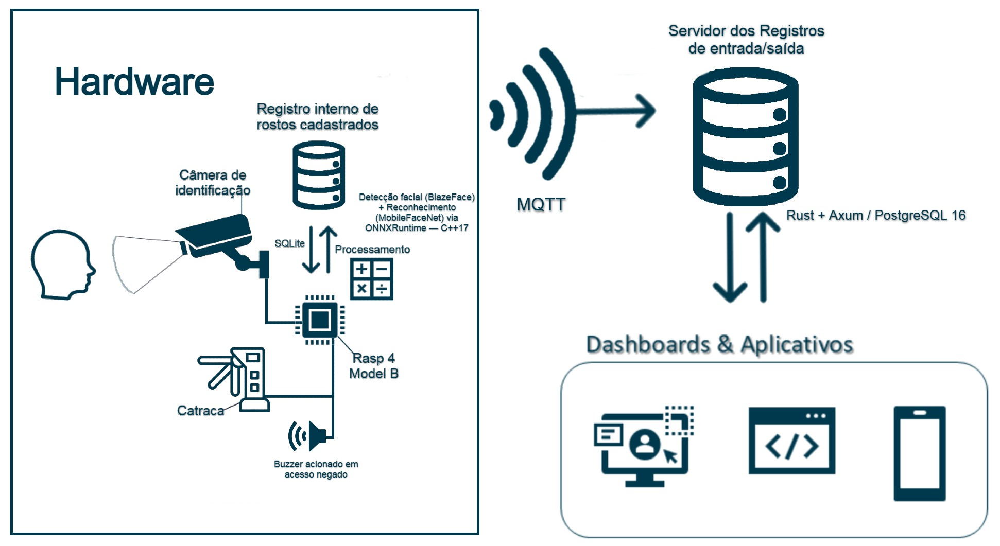

# FaceGateway

[](https://github.com/rappudo/Embarcados-Projeto/actions/workflows/ci.yml)

> Sistema de controle de acesso por reconhecimento facial com processamento embarcado, fim a fim — do Raspberry Pi ao painel web/mobile.

Reconhecimento roda **on-device**: a imagem facial nunca atravessa a rede. O edge (Raspberry Pi 4) extrai um embedding de 512 dimensões com ArcFace, compara localmente contra um cache SQLite e aciona a catraca. Eventos vão para um broker MQTT, que um backend Rust persiste em PostgreSQL+pgvector; um painel Ionic/Angular consome a API REST para gestão e analytics. A pilha inteira opera offline-resiliente: se a rede cair, o edge enfileira eventos e drena ao reconectar.

> **Status:** projeto acadêmico (Sistemas Embarcados, 7º semestre). Demo + relatório final em 27/05/2026.

---

## Highlights

- **Reconhecimento on-device.** BlazeFace + ArcFace 512-d executam no Pi via ONNXRuntime C++; o cadastro também roda no browser (via `onnxruntime-web`) — em nenhum dos caminhos a imagem bruta sai do dispositivo de captura. Apenas o vetor de 512 floats trafega na rede. Decisão arquitetural alinhada com a LGPD para dados biométricos.
- **Offline-first.** Pipeline edge enfileira eventos em SQLite quando o broker está fora; uma thread auxiliar drena `pending_events` em lotes de 50 ao reconectar. Sem perda de evento em queda de rede.
- **Hardware real, não simulação.** Servo SG90 (PWM por software a 50Hz, com `SCHED_FIFO` para reduzir jitter), buzzer ativo, LED RGB de status — controlados via `libgpiod 2.0+`. Durante a janela de 5s pós-acesso, o reconhecimento é pausado para evitar re-disparos.
- **Stack moderna e tipada de ponta a ponta.** C++17 no edge, Rust (Axum + sqlx compile-time queries) no backend, Angular 20 + Ionic 8 com signals/standalone components no painel.
- **Demo data pronta.** Seed SQL versionado (25 funcionários, 1 semana de eventos, rostos não-reconhecidos incluídos) para subir o dashboard sem precisar do Pi conectado.

---

## Arquitetura



Três camadas independentes, comunicando-se por MQTT (atuação + eventos) e HTTP REST (gestão):

| Camada | Responsabilidade | Comunicação |
|---|---|---|
| **Edge** (Raspberry Pi 4) | Captura, detecção facial, embedding, decisão de acesso, atuação física | Publica em `facegate/events/access`; subscribe em `facegate/sync/embeddings/upsert/+` |
| **Backend** (notebook ou nuvem) | API REST, persistência, autenticação JWT, subscriber MQTT | HTTP/JSON para o painel; MQTT bidirecional com edge |
| **Painel** (web + mobile PWA) | Cadastro de funcionários (com captura facial no browser), dashboard, analytics, exportação CSV | HTTP/JSON contra o backend |

**Pipeline de reconhecimento** (loop principal, ~30 fps):

```
frame → BlazeFace (detecção + keypoints)
      → alinhamento via keypoints
      → ArcFace (embedding L2-normalizado, 512-d)
      → cosine distance contra cache local (SQLite)
      → decisão:
          ├─ match (distância < 0.50): servo abre 5s, LED verde, recognition pausado
          └─ unknown:                   buzzer 400ms, LED vermelho 1s, recognition pausado
      → evento publicado no MQTT (ou enfileirado se offline)
```

---

## Stack

### Edge — Raspberry Pi 4

| Componente | Versão | Função |
|---|---|---|
| C++17 (GCC 12+) | — | Linguagem principal |
| OpenCV | 4.8 | Captura (`cv::VideoCapture`) e pré-processamento |
| ONNXRuntime | 1.17 | Inferência de BlazeFace + ArcFace |
| libgpiod | ≥ 2.0 | Servo, buzzer, LED RGB |
| libmosquittopp | 2.x | Cliente MQTT |
| SQLite (SQLiteCpp) | 3.x | Cache de embeddings + fila offline |
| toml++ | — | Parser de configuração |

### Backend — Servidor

| Componente | Versão | Função |
|---|---|---|
| Rust | edition 2024 | Linguagem principal |
| Axum | 0.7 | Framework HTTP |
| sqlx | 0.7 | Driver SQL com queries verificadas em tempo de compilação |
| rumqttc | 0.24 | Subscriber MQTT assíncrono |
| pgvector | 0.3 | Busca por similaridade vetorial |
| jsonwebtoken | 9.x | Auth JWT (HS256) |

### Painel — Web + Mobile

| Componente | Versão | Função |
|---|---|---|
| Angular | 20 (signals, standalone) | Framework SPA |
| Ionic | 8 | Componentes UI multiplataforma |
| onnxruntime-web | 1.26 | BlazeFace + ArcFace no browser (enrollment) |
| Capacitor | 8 | Empacotamento mobile (PWA + nativo) |

### Infraestrutura

| Serviço | Imagem | Porta |
|---|---|---|
| PostgreSQL + pgvector | `pgvector/pgvector:pg16` | 5432 |
| Mosquitto MQTT broker | `eclipse-mosquitto:2` | 1883 |

---

## Quick start

### Pré-requisitos

- Docker + Docker Compose
- Rust ([rustup](https://rustup.rs))
- Node.js 20+ e Ionic CLI: `npm install -g @ionic/cli`
- C++17, CMake 3.16+ (apenas para o edge no Pi)

### 1. Subir banco e broker

```bash
cp .env.example .env       # ajustar POSTGRES_PASSWORD e JWT_SECRET
cd infra
docker compose --env-file ../.env up -d

# verificação
docker exec facegate-db psql -U facegate -d facegate \
  -c "SELECT extname, extversion FROM pg_extension WHERE extname = 'vector';"
docker exec facegate-broker mosquitto_pub -t test/ping -m ok && echo "broker ok"
```

As migrations em `infra/migrations/` rodam automaticamente no primeiro boot do container.

### 2. (Opcional) Popular dados de demonstração

```bash
docker exec -i facegate-db psql -U facegate -d facegate < infra/seed_demo.sql
```

Inclui 25 funcionários fictícios, 1 semana de `access_events` (com 22 rostos não-reconhecidos) e o usuário `teste@facegate.local`. Idempotente — pode rodar várias vezes.

### 3. Backend

```bash
cd backend
cargo run --release
# escuta em [::]:3000 (dual-stack IPv4 + IPv6)
```

### 4. Painel

```bash
cd panel
npm install
ionic serve                # http://localhost:8100
```

**Credenciais do admin (seed):** `admin@facegate.local` / `admin123`
**Usuário de testes (após seed_demo.sql):** `teste@facegate.local` / `teste123`

### 5. Edge (no Raspberry Pi)

```bash
# dependências do sistema (Raspberry Pi OS Bookworm)
sudo apt install build-essential cmake pkg-config \
  libopencv-dev libonnxruntime-dev libgpiod-dev \
  libmosquittopp-dev libsqlite3-dev nlohmann-json3-dev \
  libtomlplusplus-dev

# baixar modelos ONNX (não versionados — ver seção abaixo)

cd edge
cmake -S . -B build -DCMAKE_BUILD_TYPE=Release
cmake --build build -j$(nproc)

# rodar com SCHED_FIFO para evitar jitter no PWM do servo
cp config/config.example.toml config/config.toml
# editar config.toml: device da câmera, IP do broker, GPIO pins
sudo ./build/facegate --config config/config.toml
```

> O binário resolve `migrations/schema.sql` relativo ao CWD — rodar de dentro de `edge/`.

---

## Modelos ONNX

Não versionados no repositório (130MB do ArcFace ultrapassam limites razoáveis para Git). Baixar e colocar em `edge/models/`:

| Modelo | Tamanho | Origem | Nome esperado |
|---|---|---|---|
| BlazeFace (MediaPipe) | ~530 KB | [google/mediapipe](https://github.com/google/mediapipe/tree/master/mediapipe/models) | `blaze.onnx` |
| ArcFace (InsightFace) | ~130 MB | [deepinsight/insightface](https://github.com/deepinsight/insightface) | `arc.onnx` |

O backend serve esses dois arquivos em `${API_BASE_URL}/models/` para que o painel possa carregá-los para o enrollment no browser via `onnxruntime-web`.

---

## CLI de enrollment (alternativa ao painel)

Para cadastro presencial direto pelo Pi, sem precisar do painel:

```bash
./build/enroll --config config/config.toml --employee-id 5 [--photos 5] [--append]
```

Captura N fotos do funcionário (pressione Enter para cada), gera embeddings via ArcFace e grava direto no SQLite local. O `facegate` daemon os publica via MQTT na próxima execução. `--append` adiciona aos embeddings existentes em vez de substituir.

---

## Endpoints da API

Todos os endpoints protegidos exigem `Authorization: Bearer <jwt>` (obtido em `POST /auth/login`).

### Autenticação
- `POST /auth/login` — `{email, password}` → `{token, user}`

### Funcionários e embeddings
- `GET    /employees` — listagem
- `POST   /employees` — `{name, shift?}`
- `GET    /employees/:id`
- `PATCH  /employees/:id`
- `DELETE /employees/:id` (cascateia embeddings; events ficam com FK nula)
- `GET    /employees/:id/embeddings`
- `POST   /employees/:id/embeddings` — `{vector: number[512]}`

### Analytics
- `GET /analytics/access-by-hour` — fluxo por hora
- `GET /analytics/events` — lista paginada com filtros
- `GET /analytics/avg-delay` — atraso médio por funcionário (filtra `direction='in'`, normaliza delta para `(-12h, +12h]`)
- `GET /analytics/presence-heatmap` — presença por dia da semana × hora
- `GET /analytics/summary-today` — KPIs do dia
- `GET /analytics/present-today` — funcionários atualmente "dentro"

### Sistema
- `GET /health` — sem autenticação
- `GET /system/mqtt-status`
- `GET /users` / `POST /users`
- `GET /models/*` — serve `edge/models/` como assets estáticos

### Documentação interativa (OpenAPI / Swagger)
- `GET /swagger-ui/` — Swagger UI interativo, lista todos os endpoints com payloads e botão "Try it out".
- `GET /api-docs/openapi.json` — spec OpenAPI 3.1 gerada a partir das anotações `#[utoipa::path]` nos handlers.

---

## Estrutura do repositório

```
facegate/
├── edge/                  # C++ — pipeline embarcado (Raspberry Pi)
│   ├── apps/
│   │   ├── facegate/      # daemon principal (vision + GPIO + MQTT)
│   │   └── enroll/        # CLI de cadastro por câmera
│   ├── src/
│   │   ├── config/        # parser TOML
│   │   ├── domain/        # tipos puros
│   │   ├── hardware/      # câmera, servo, buzzer, RGB LED
│   │   ├── vision/        # BlazeFace, ArcFace, matcher
│   │   ├── pipeline/      # loop principal + auxiliar
│   │   ├── storage/       # SQLite (cache + queue offline)
│   │   └── mqtt/          # publisher + subscriber + serialização
│   ├── config/            # config.toml (local) + .example.toml
│   ├── migrations/        # schema SQLite do cache
│   └── models/            # blaze.onnx + arc.onnx (gitignored)
│
├── backend/               # Rust — API REST + subscriber MQTT
│   ├── src/
│   │   ├── routes/        # axum handlers
│   │   ├── models/        # DTOs e wire types
│   │   └── mqtt/          # consumer de access_events
│   └── Cargo.toml
│
├── panel/                 # Ionic + Angular — painel web/mobile
│   └── src/app/
│       ├── core/          # serviços HTTP + auth + visão (browser)
│       ├── features/      # páginas próximas (enrollment wizard, settings)
│       ├── shared/        # componentes reutilizáveis (cards, badges)
│       ├── dashboard/     # tela principal de uso hoje
│       └── ...            # login, cadastro, perfil
│
├── infra/                 # Docker + migrations Postgres
│   ├── docker-compose.yml
│   ├── migrations/        # SQL aplicado pelo Postgres no boot
│   ├── seed_demo.sql      # 25 funcionários + 1 semana de eventos
│   └── mosquitto.conf
│
└── docs/
    ├── Main.tex           # relatório acadêmico (LaTeX)
    ├── arquitetura.png    # diagrama
    └── CODE_GUIDE.md      # referência exaustiva file-by-file
```

---

## Documentação adicional

- **`CONTRIBUTING.md`** — onboarding em uma página: setup, comandos por camada, fluxo de PR. Bom ponto de partida se você acabou de clonar o repo.
- **`docs/Main.tex`** — relatório completo do projeto. Compilar: `pdflatex docs/Main.tex` (rodar duas vezes para resolver `\ref`).
- **`docs/CODE_GUIDE.md`** — referência file-by-file: o que cada arquivo faz, funções/classes que expõe, e como se conecta com o resto.
- **`edge/DESIGN.md`** — decisões arquiteturais do módulo embarcado.
- **`backend/tests/README.md`**, **`panel/src/app/TESTING.md`**, **`edge/tests/README.md`** — guias por camada para rodar e estender os testes automatizados.

---

## Testes automatizados

**193 testes**, cobrindo as três camadas. Tudo roda em CI no GitHub Actions em cada push/PR — ver badge no topo deste README ou a aba *Actions*.

| Camada  | Testes | Stack                                  | Comando                                                                                  |
| ------- | ------:| -------------------------------------- | ---------------------------------------------------------------------------------------- |
| Backend | 66     | Rust integration tests + Postgres real | `cd backend && DATABASE_URL=... cargo test -- --test-threads=1`                          |
| Painel  | 88     | Jasmine + Karma + Chromium headless    | `cd panel && CHROME_BIN=/usr/bin/chromium npm test -- --watch=false --browsers=ChromeHeadlessCI` |
| Edge    | 39     | GoogleTest + ctest                     | `cd edge && cmake -S . -B build -DBUILD_TESTING=ON && cmake --build build && ctest --test-dir build` |

### O que cada suíte cobre

- **Backend** (`backend/tests/`): JWT (login + expiry + secret mismatch), CRUD de funcionários, criação de usuários (incluindo duplicate-email 409), embeddings (round-trip lossless 512-d + 404 em FK violation + cascade), handler MQTT (insert, validações, drops silenciosos), todos os 6 endpoints de analytics (incluindo a normalização do `avg-delay` para `noite` cruzando a meia-noite).
- **Painel** (`panel/src/app/`): `AuthService` (signal + expiry check), interceptor (Bearer attach, 401 → logout, sessão local expirada), guard, todos os serviços de `core/api`, mapeamento DTO ↔ `Funcionario`, `LoginPage` (success, 401, network error, double-submit guard, mensagens pt-BR).
- **Edge** (`edge/tests/`): cosine matcher (boundary do threshold, upsert insert/replace, guard de norma zero), serialização MQTT (contrato de JSON em sync com o backend), cache SQLite (round-trip de BLOB com todos 512 floats, fila offline FIFO), parser TOML (campos obrigatórios, ranges válidos, GPIO pin uniqueness).

### Coverage

O job de CI gera relatório de cobertura por camada e publica como artifact (download na aba *Actions* → run específico). Ferramentas:

| Camada  | Ferramenta        | Artifact            |
| ------- | ----------------- | ------------------- |
| Backend | `cargo-llvm-cov`  | `backend-coverage`  |
| Painel  | `karma-coverage`  | `panel-coverage`    |
| Edge    | `gcovr` (gcc 16+) | `edge-coverage`     |

Para rodar localmente:

```bash
# Backend (precisa de llvm-tools-preview): cargo install cargo-llvm-cov
cd backend && cargo llvm-cov --lcov --output-path coverage.lcov -- --test-threads=1

# Painel
cd panel && npm test -- --watch=false --browsers=ChromeHeadlessCI --code-coverage

# Edge (gcovr via pacman ou pip install gcovr)
cd edge && cmake -S . -B build -DBUILD_TESTING=ON \
  -DCMAKE_CXX_FLAGS="-O0 --coverage" -DCMAKE_EXE_LINKER_FLAGS="--coverage" && \
cmake --build build && ctest --test-dir build && \
gcovr --root . --filter 'src/' --filter 'apps/' --print-summary build
```

---

## Troubleshooting

**Câmera bloqueada no painel** — `getUserMedia` (a API de webcam do browser) exige HTTPS ou `localhost`. Acessar o painel por IP da LAN sobre HTTP plain falha silenciosamente. Para a demo, usar `ionic serve` em `http://localhost:8100`.

**Primeira captura no enrollment demora 10–30s** — `arc.onnx` tem ~130 MB e é baixado do backend no primeiro acesso. Abrir o wizard uma vez antes da apresentação para popular o cache do browser.

**Requests para `/analytics/events` falham silenciosamente** — algumas filter lists do uBlock Origin bloqueiam URLs contendo `analytics`. Desabilitar a extensão para o site ou usar `127.0.0.1` (já é o default desde a configuração atual do `environment.ts`).

**Servo "tremendo"** — software PWM em userspace tem jitter sob carga. O código eleva a thread do `Turnstile` para `SCHED_FIFO`, mas isso requer `CAP_SYS_NICE` — rodar com `sudo`. Procurar no stderr a linha `SCHED_FIFO unavailable` para confirmar.

**GPIO line request failed** — outra instância do `facegate` está segurando a linha. Mata-la com `sudo pkill -f facegate` (verificar `gpioinfo` para ver o consumidor atual).

---

## Apresentação

Slides: [Canva](https://canva.link/5o6q6nqca953iau)

---

## Equipe

Projeto desenvolvido como entrega final da disciplina **Sistemas Embarcados** (7º semestre):

- **Ramon Veloso Vieira** — edge C++ + Rust crítico (toolchain, pipeline de visão, GPIO, JWT, sync de embeddings)
- **Nícolas** — backend + banco (Axum, sqlx, subscriber MQTT, schema, analytics)
- **Kaique C.** — integração edge + UI (buzzer, fila offline, histórico de eventos, documentação)
- **Vinicius D.** — frontend + design (Ionic/Angular/PWA, login, funcionários, dashboard)
