# FaceGateway — Documentação de Entrega

**Disciplina:** Sistemas Embarcados — 7º semestre
**Data da apresentação:** 27/05/2026
**Equipe:** Ramon Veloso Vieira · Nícolas Pereira · Kaique Rissato · Vinicius Venancio
**Repositório:** <https://github.com/rappudo/Embarcados-Projeto>

---

## Visão geral

FaceGateway é um sistema de controle de acesso por reconhecimento facial
com processamento **on-device**. Uma Raspberry Pi 4 captura imagem, roda
detecção + embedding facial localmente, decide pela liberação de uma
catraca (servo SG90) e publica o evento por MQTT. Um backend em Rust
hospedado em **EC2 (AWS Academy)** persiste os eventos em PostgreSQL +
pgvector e expõe API REST para um painel Ionic/Angular. **A imagem
facial nunca trafega na rede** — inferência roda no ponto de captura, e
até o cadastro pelo painel executa BlazeFace + ArcFace dentro do
browser via `onnxruntime-web`, enviando apenas o vetor de 512 dimensões.

Demonstração end-to-end resumida:

1. Cadastro do funcionário pelo painel (foto via webcam → embedding no
   browser → `POST /api/employees/:id/embeddings` com o vetor).
2. Backend persiste o embedding e re-publica no tópico MQTT retido
   `facegate/sync/embeddings/upsert/<id>`; a Pi recebe e atualiza o
   cache local.
3. Pessoa se posiciona em frente à câmera do Pi.
4. Edge faz captura → detecção → alinhamento → embedding → busca local.
5. Match: servo abre 5 s, LED verde, evento publicado por MQTT.
6. Backend persiste; painel atualiza KPIs e a aba "Não reconhecidos".

---

## 1. Dispositivo IoT — Raspberry Pi 4

A camada embarcada roda em **C++17** na Raspberry Pi 4 (4 GB) e
controla todos os atuadores físicos via `libgpiod ≥ 2.0`. O pipeline de
reconhecimento opera continuamente a ~30 fps em ciclos vazios; quando
um rosto é detectado, a inferência ArcFace domina (~650 ms p50 na Pi 4
com 2 *threads* ONNX). Detalhe completo de latência por estágio em
§7.2 do relatório acadêmico (`docs/Main.tex`).

```
frame → BlazeFace (bbox + 6 keypoints)
      → similarity transform a partir dos dois olhos (alinhamento 112×112)
      → ArcFace (vetor L2-normalizado de 512 dimensões)
      → distância de cosseno contra cache local SQLite
      → decisão:
          • match (dist < 0.50): servo abre 5 s, LED verde, recognition pausado
          • unknown:             buzzer 400 ms, LED vermelho 1 s, pausado
      → evento publicado por MQTT (ou enfileirado se offline)
```

**Resiliência offline:** quando o broker está fora, eventos são
enfileirados em SQLite local (`pending_events`); uma thread auxiliar
drena a fila em lotes de 50 ao reconectar. Nenhum evento é perdido.

**Hardware:**

| Componente            | Conexão                                          |
|-----------------------|--------------------------------------------------|
| Raspberry Pi 4 (4 GB) | —                                                |
| Câmera USB/CSI        | `/dev/video0` (`cv::VideoCapture`)               |
| Servo SG90 (catraca)  | GPIO 17 (PWM software 50 Hz, thread `SCHED_FIFO`) |
| Buzzer ativo          | GPIO 27                                          |
| LED RGB de status     | GPIOs 22 / 23 / 24 (R/G/B), resistor 220–330 Ω por canal |

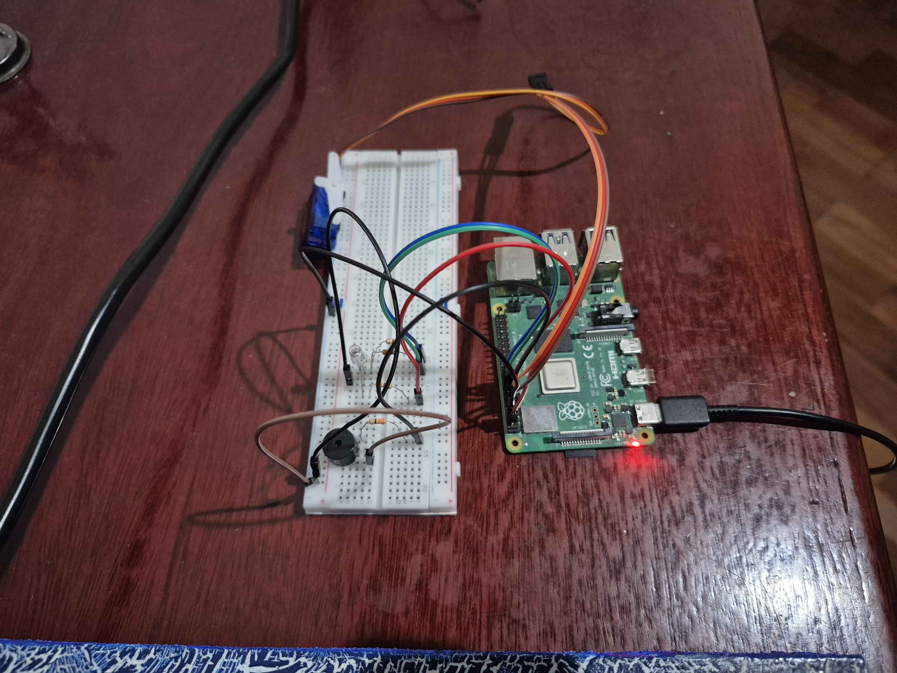
*Figura 1 — Bancada física: Pi 4, câmera, servo SG90, buzzer e LED RGB
na protoboard.*


*Figura 2 — Daemon conectado ao broker MQTT na EC2 (`MqttPublisher:
connected to 32.196.147.237:1883`), embeddings sincronizados do painel
via `facegate/sync/embeddings/upsert/+`, e linhas `Pipeline: MATCH`
após o reconhecimento.*

### Tópicos MQTT

| Tópico                                         | Direção        | Conteúdo                                                                 |
|-----------------------------------------------|----------------|--------------------------------------------------------------------------|
| `facegate/events/access`                       | edge → backend | Evento de acesso (granted/unknown), `employee_id`, `distance`, timestamp |
| `facegate/health/heartbeat`                    | edge → backend | Heartbeat periódico (30 s) com `device_id`                               |
| `facegate/health/fault`                        | edge → backend | Falha de hardware ou inferência                                          |
| `facegate/sync/embeddings/upsert/+`            | backend → edge | Sincronização de embeddings vindos do painel (wildcard = `employee_id`)  |

Todos com **QoS 1**. O broker autentica clientes via *username/password*
(usuários distintos para backend e edge); o tópico de sync é publicado
com `retain=true` para que um Pi recém-conectado receba imediatamente o
estado corrente da galeria de funcionários.

### Software embarcado

| Lib               | Versão  | Uso                                              |
|-------------------|---------|--------------------------------------------------|
| OpenCV            | 4.8     | Captura + pré-processamento                      |
| ONNXRuntime       | 1.17    | Inferência de BlazeFace + ArcFace                |
| libgpiod          | ≥ 2.0   | Servo, buzzer, LED RGB                           |
| libmosquittopp    | 2.x     | Cliente MQTT (publisher + subscriber)            |
| SQLite (SQLiteCpp)| 3.x     | Cache de embeddings + fila offline               |
| toml++            | —       | Parser de configuração                           |

Modelos ONNX usados (não versionados — ver `README.md`):

- `blaze.onnx` (~530 KB) — BlazeFace do Google MediaPipe.
- `arc.onnx` (~130 MB) — ArcFace do InsightFace, embedding 512-d.

**Código fonte:**
- Daemon principal: <https://github.com/rappudo/Embarcados-Projeto/tree/main/edge/apps/facegate>
- CLI de enrollment via Pi: <https://github.com/rappudo/Embarcados-Projeto/tree/main/edge/apps/enroll>
- Pipeline e visão: <https://github.com/rappudo/Embarcados-Projeto/tree/main/edge/src>
- Configuração: <https://github.com/rappudo/Embarcados-Projeto/blob/main/edge/config/config.example.toml>

---

## 2. Back-end

Servidor em **Rust + Axum**, deployado como stack completo em uma
**instância EC2 (AWS Academy)** via `docker compose`. Quatro
containers compõem o lado servidor; a Raspberry Pi conecta pela
internet pública contra o broker autenticado.

```
                ┌──────────────────────── EC2 t3.medium ────────────────────────┐
                │                                                                │
                │   docker network: facegate                                     │
                │  ┌──────────┐   ┌──────────────┐   ┌────────────┐   ┌────────┐ │
   Pi 4 ──MQTT─┼─►│ mosquitto│◄──┤ backend Rust │──►│ postgres   │   │ caddy  │ │
   (1883, auth)│   │  :1883   │   │    :3000     │   │ + pgvector │   │  :80   │ │
                │  └──────────┘   └──────────────┘   └────────────┘   └────┬───┘ │
                │                       ▲                                  │     │
                │                       └──────── reverse proxy /api/* ────┘     │
                └──────────────────────┬──────────────────────────────┬─────────┘
                                       │  porta 80 pública             │
                                       ▼                               ▼
                                  navegador (painel SPA)        operador via HTTP
```

- **MQTT** (`:1883`): aberto publicamente; `allow_anonymous false` —
  backend e Pi têm credenciais distintas no `passwordfile` do broker.
- **Caddy** (`:80`): serve o painel Angular estático e faz reverse proxy
  de `/api/*` para o backend, resultando em chamadas same-origin do
  navegador (sem preflight CORS).
- **PostgreSQL** (`:5432`): só acessível dentro da docker network.
  Bind em `127.0.0.1:5432` no host para acesso administrativo via SSH
  tunnel — nunca exposto à internet.
- **JWT secret, senhas de DB e MQTT**: gerados via `openssl rand` e
  carregados via `.env` (gitignored). Runbook completo em
  [`infra/deploy/EC2.md`](../infra/deploy/EC2.md).

> Sem TLS no MVP: AWS Academy não fornece domínio e certificados
> Let's Encrypt exigem hostname. HTTP + MQTT autenticado é aceitável
> para o demo; em produção real, basta adicionar `tls { ... }` ao
> Caddyfile e o broker passa para 8883 com cert auto-emitido.

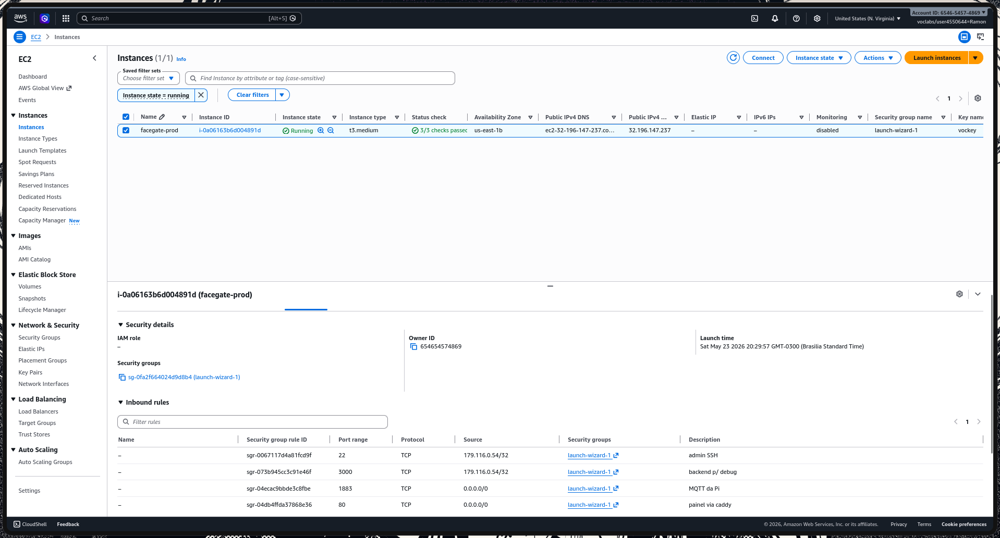
*Figura 3 — Instância `facegate-prod` rodando na AWS Academy, com as
regras de *inbound* do security group: SSH (22) e backend de debug
(3000) restritos ao IP do operador; HTTP (80) e MQTT (1883) abertos
publicamente — a auth do broker é o único gate de fato.*

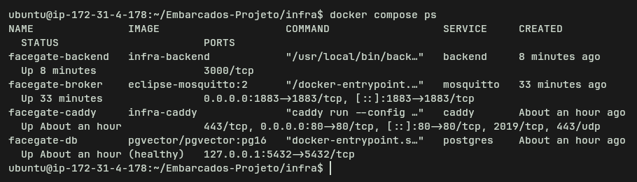
*Figura 4 — Stack em produção: `facegate-db` (Postgres + pgvector,
healthy), `facegate-broker` (Mosquitto autenticado), `facegate-backend`
(API Rust) e `facegate-caddy` (reverse proxy + estática do painel).*

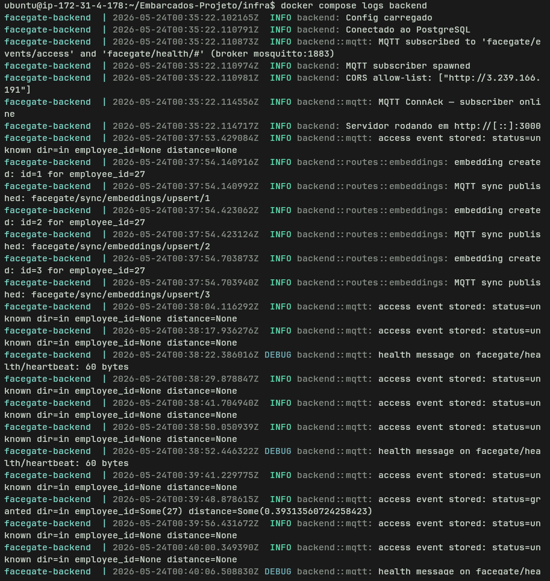
*Figura 5 — Log do backend após boot completo: `Conectado ao
PostgreSQL`, `MQTT ConnAck — subscriber online`, e o fluxo de
`access event stored` à medida que a Pi publica.*

**Stack:**

- Rust edition 2024, Axum 0.7, sqlx 0.8 (queries verificadas em compile-time)
- rumqttc 0.24 (subscriber MQTT assíncrono no runtime Tokio)
- PostgreSQL 16 + pgvector 0.6
- jsonwebtoken 9.x (JWT HS256)
- Docker Compose (Postgres, Mosquitto, backend, Caddy) — sobe inteiro com `docker compose up -d --build`

**Principais endpoints REST** (acessíveis como `/api/*` via Caddy):

| Método  | Rota                                     | Descrição                                              |
|---------|------------------------------------------|--------------------------------------------------------|
| POST    | `/auth/login`                            | Autenticação JWT                                       |
| GET/POST/PATCH/DELETE | `/employees[/:id]`         | CRUD de funcionários                                   |
| POST    | `/employees/:id/embeddings`              | Upload do vetor 512-d (do enrollment no browser)       |
| GET     | `/analytics/access-by-hour`              | Fluxo de acessos por hora                              |
| GET     | `/analytics/avg-delay`                   | Atraso médio por funcionário (filtra `direction='in'`, normaliza overflow de meia-noite) |
| GET     | `/analytics/presence-heatmap`            | Mapa de calor presença × dia da semana                 |
| GET     | `/analytics/summary-today`               | KPIs do dia (total, únicos, não reconhecidos)          |
| GET     | `/analytics/events`                      | Lista paginada de eventos com filtros                  |
| GET     | `/system/mqtt-status`                    | Saúde da conexão MQTT                                  |

Documentação interativa OpenAPI 3.1 gerada automaticamente a partir das
anotações `#[utoipa::path]` dos handlers: `GET /api/api-docs/openapi.json`.

**Testes automatizados:** 66 testes de integração em Rust contra um
Postgres real, cobrindo JWT, CRUD, embeddings (round-trip lossless de
512 floats), o handler MQTT e os 6 endpoints de analytics. Executam em
CI a cada push.

**Código fonte:**
- Backend: <https://github.com/rappudo/Embarcados-Projeto/tree/main/backend>
- Infra (docker-compose + Caddyfile + scripts): <https://github.com/rappudo/Embarcados-Projeto/tree/main/infra>
- Runbook de deploy: <https://github.com/rappudo/Embarcados-Projeto/blob/main/infra/deploy/EC2.md>
- Seed de demonstração (25 funcionários, 1 semana de eventos): <https://github.com/rappudo/Embarcados-Projeto/blob/main/infra/seed_demo.sql>

---

## 3. Painel web/mobile

Painel desenvolvido em **Ionic 8 + Angular 20** (standalone components,
signals), instalável como **Progressive Web App** — funciona no browser
desktop e pode ser adicionado à tela inicial do celular sem loja de
aplicativos.

**Telas implementadas:**

| Tela                | Função                                                                 |
|---------------------|------------------------------------------------------------------------|
| Login               | Autenticação JWT com `authGuard` em todas as rotas privadas            |
| Dashboard           | KPIs do dia, gráfico de fluxo por hora, card "Não reconhecidos (7 d)" com mini bar-chart e lista dos mais recentes |
| Cadastro            | CRUD de funcionários + **wizard de enrollment no browser** (BlazeFace + ArcFace via `onnxruntime-web`) |
| Perfil              | Dados do usuário logado, botão de logout                               |
| Exportar Dados      | Multi-select de funcionários, filtros de período, CSV pronto para Excel/Sheets (UTF-8 BOM + `;`) |
| Analytics           | Atraso médio por funcionário, heatmap presença × dia/hora              |

**Decisão arquitetural relevante:** o wizard de cadastro carrega
`blaze.onnx` e `arc.onnx` do endpoint `/api/models/*` do backend (Caddy
faz reverse proxy) e roda a inferência **dentro do browser** via
`onnxruntime-web`. A foto bruta nunca trafega — só o vetor
L2-normalizado de 512 floats vai para a API. Isso reforça a postura
LGPD do sistema também no caminho de administração.

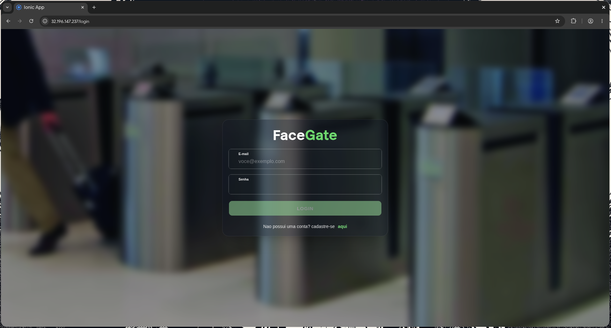
*Figura 6 — Login com JWT. O `authGuard` redireciona qualquer rota
privada para esta tela quando o token expira (8 h) ou retorna 401.*

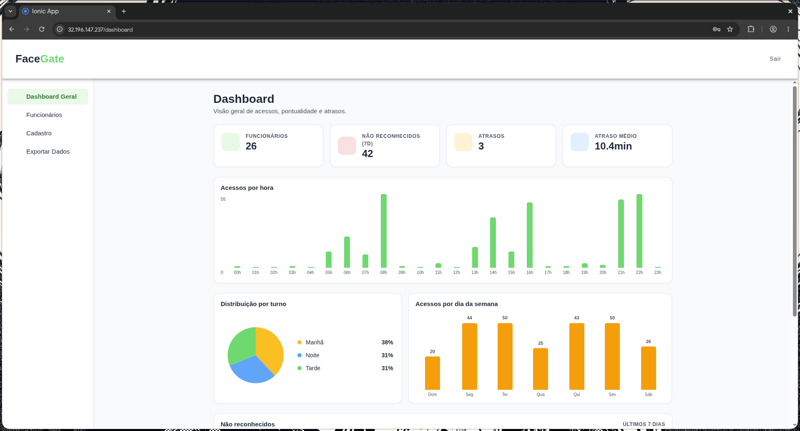
*Figura 7 — Dashboard populado pelo seed de demonstração (25
funcionários, ~280 eventos sintéticos). Cards superiores são KPIs do
dia; gráfico no centro é fluxo de acessos por hora; card inferior
agrupa não reconhecidos dos últimos 7 dias com mini bar-chart.*

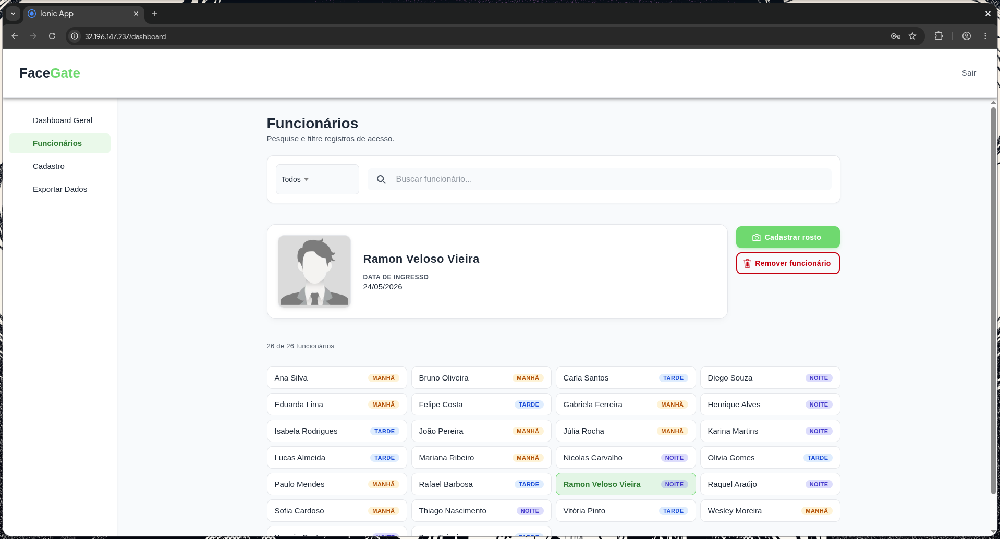
*Figura 8 — Tela de cadastro após o enrollment do operador real
(Ramon, id 27) — visível ao lado das 25 entradas sintéticas do seed.*

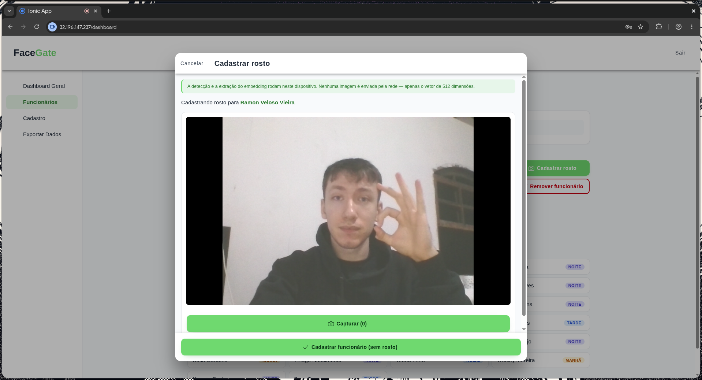
*Figura 9 — Wizard de cadastro facial executando BlazeFace + ArcFace
em `onnxruntime-web` dentro do próprio browser. A imagem nunca é
enviada à rede; apenas o vetor 512-d resultante.*

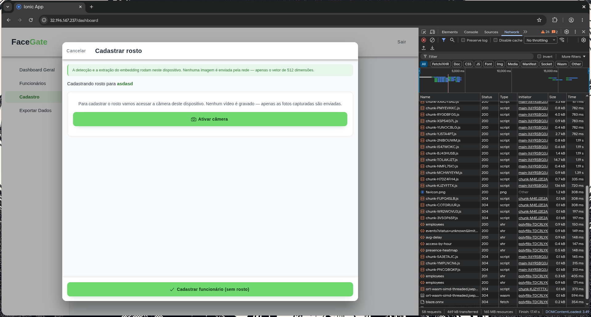
*Figura 10 — DevTools do browser durante o primeiro acesso ao wizard:
`/api/models/blaze.onnx` (~530 KB) e `/api/models/arc.onnx` (~130 MB)
servidos estaticamente pelo Caddy a partir de `edge/models/`. Cache do
service worker reaproveita em sessões subsequentes.*

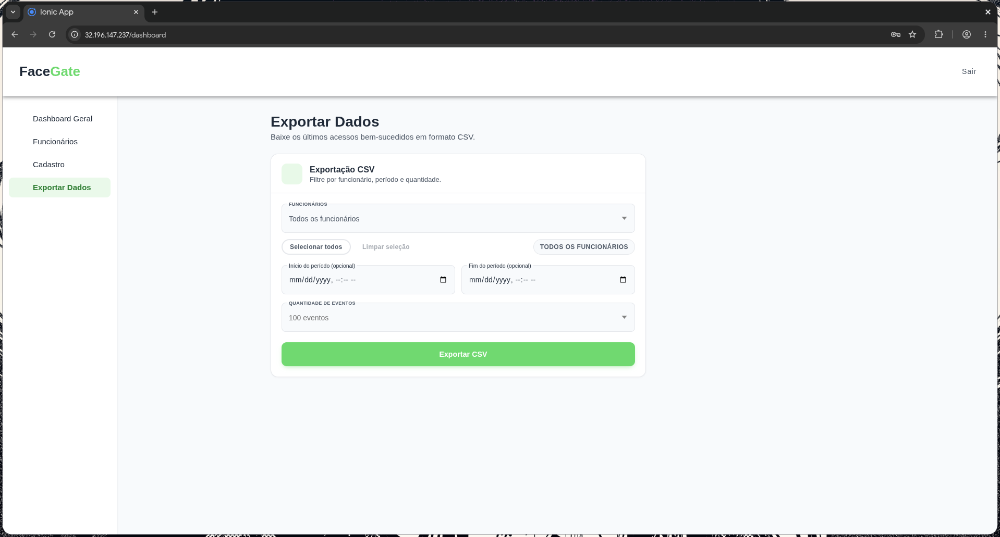
*Figura 11 — Tela de exportação. Multi-select de funcionários,
seletor de período e geração do CSV pronto para Excel/Sheets.*

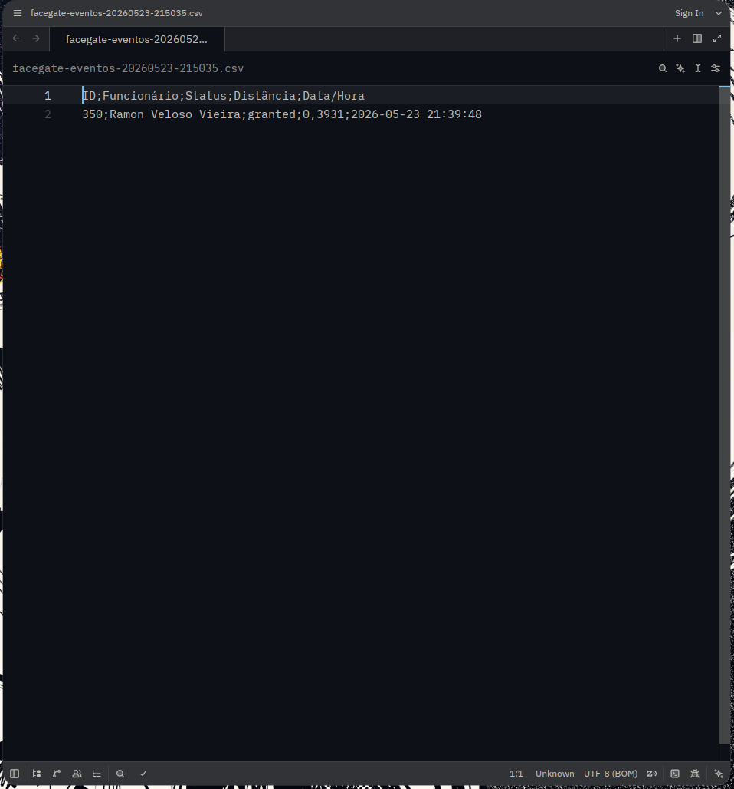
*Figura 12 — Resultado da exportação: UTF-8 com BOM + separador `;`,
abrindo corretamente em planilhas brasileiras sem mojibake nem
truncamento de colunas.*

**Testes automatizados:** 88 testes em Jasmine + Karma (Chromium
headless) — `AuthService` (signals + expiry), HTTP interceptor (anexar
Bearer, logout em 401), `LoginPage` (sucesso, 401, erro de rede,
guard contra duplo submit), todos os serviços de `core/api`, e o
mapeamento DTO ↔ `Funcionario`. Executam em CI.

**Código fonte:** <https://github.com/rappudo/Embarcados-Projeto/tree/main/panel>

---

## 4. Evidências de qualidade

- **CI no GitHub Actions** ([badge no README](https://github.com/rappudo/Embarcados-Projeto/actions/workflows/ci.yml))
  executa nas três camadas a cada push:
  - 44 testes no edge (GoogleTest + ctest)
  - 66 testes no backend (Rust + Postgres real)
  - 88 testes no painel (Jasmine + Karma headless)
  - **Total: 198 testes**
  - Relatórios de cobertura publicados como *artifacts* (cargo-llvm-cov,
    karma-coverage, gcovr).
- **Documentação técnica:**
  - `README.md` — landing page do projeto, quick start por camada.
  - `docs/Main.tex` — relatório acadêmico completo.
  - `docs/CODE_GUIDE.md` — referência *file-by-file*.
  - `edge/DESIGN.md` — decisões arquiteturais do módulo embarcado.
- **Demo seed:** `infra/seed_demo.sql` popula o banco com 25
  funcionários, 1 semana de eventos sintéticos com jitter realista e 22
  rostos não reconhecidos — permite demonstrar o painel sem o Pi
  conectado.

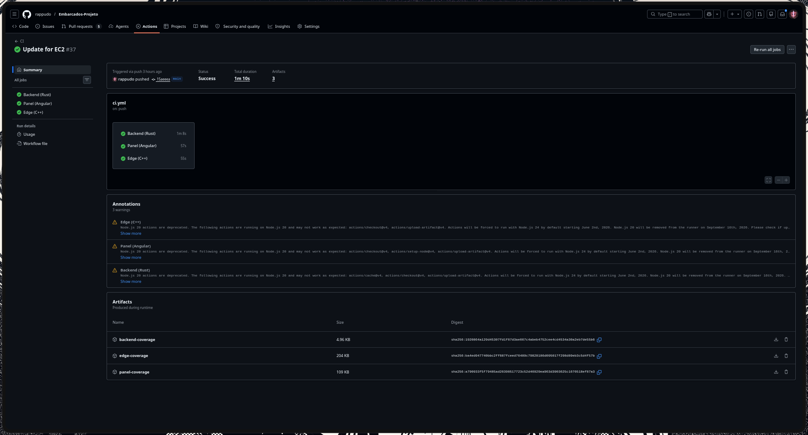
*Figura 13 — Aba *Actions* do GitHub mostrando um run recente do
workflow `ci` em verde: as três suítes (edge / backend / painel)
passando em paralelo no mesmo push.*

---

## 5. Checklist de requisitos

| Requisito                                                     | Status | Onde se evidencia                                  |
|---------------------------------------------------------------|:------:|----------------------------------------------------|
| Dispositivo IoT (microcontrolador embarcado)                  | ✅     | Raspberry Pi 4 — seção 1 + Figura 1                |
| Sensor de entrada                                             | ✅     | Câmera USB/CSI (`cv::VideoCapture`)                |
| Atuadores físicos                                             | ✅     | Servo SG90, buzzer ativo, LED RGB — Figura 1       |
| Comunicação por MQTT                                          | ✅     | 4 tópicos documentados (seção 1) — Figura 2        |
| MQTT com autenticação                                         | ✅     | `allow_anonymous false` + password_file — Figura 5 |
| Back-end                                                      | ✅     | Rust + Axum + Docker (seção 2) — Figuras 4, 5      |
| Banco de dados                                                | ✅     | PostgreSQL 16 + pgvector 0.6                       |
| Deploy em nuvem (EC2)                                         | ✅     | Stack docker-compose + runbook — Figuras 3, 4      |
| Front-end / dashboard                                         | ✅     | Ionic 8 + Angular 20 PWA (seção 3) — Figuras 6–12  |
| Autenticação                                                  | ✅     | JWT HS256 + `authGuard` — Figura 6                 |
| Processamento embarcado (edge inteligente)                    | ✅     | BlazeFace + ArcFace rodam on-device em C++/ONNX    |
| Resiliência offline                                           | ✅     | Fila SQLite + drainer ao reconectar                |
| Considerações de LGPD / privacidade                           | ✅     | Imagens não trafegam — só embeddings 512-d (Fig. 9)|
| Testes automatizados                                          | ✅     | 198 testes em CI (3 suítes) — Figura 13            |
| Documentação técnica                                          | ✅     | `Main.tex`, `README.md`, `CODE_GUIDE.md`, `DESIGN.md` |
| Demonstração executável                                       | ✅     | Seed SQL + `docker compose up -d --build`          |

---

## 6. Links rápidos

- **Repositório:** <https://github.com/rappudo/Embarcados-Projeto>
- **CI / Actions:** <https://github.com/rappudo/Embarcados-Projeto/actions>
- **Slides:** <https://canva.link/5o6q6nqca953iau>
- **Relatório acadêmico completo:** `docs/Main.tex` (rodar `pdflatex` duas vezes)
- **Runbook de deploy em EC2:** [`infra/deploy/EC2.md`](../infra/deploy/EC2.md)
- **Referência file-by-file:** `docs/CODE_GUIDE.md`
- **Quick start completo:** `README.md`
